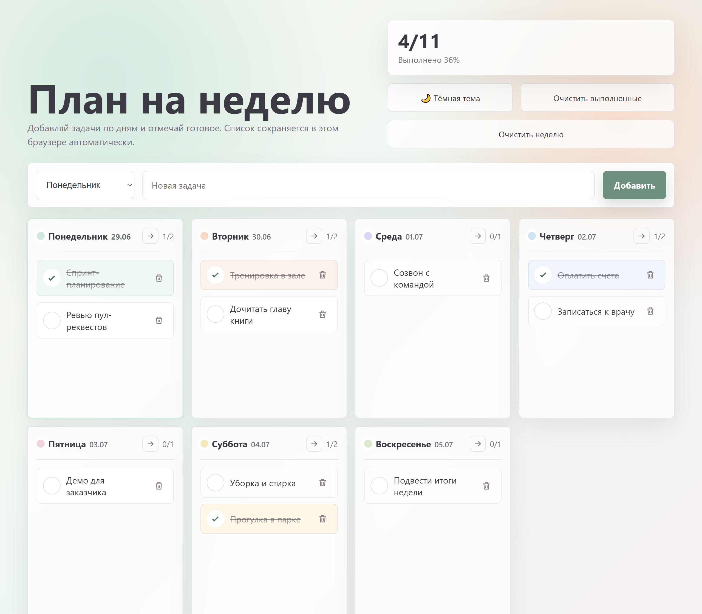

# 📅 План на неделю

Простой и приятный планировщик задач на неделю. Добавляй задачи по дням, отмечай выполненное и следи за прогрессом. Весь список сохраняется прямо в браузере — без регистрации, серверов и установки.



## ✨ Возможности

- **7 дней недели** — каждый день со своим мягким цветом и датой текущей недели; сегодняшний день подсвечивается.
- **Добавление задач** — выбери день, введи текст и нажми «Добавить».
- **Отметка выполнения** — клик по кружку зачёркивает задачу и подсвечивает её.
- **Удаление задач** — по кнопке с корзиной.
- **Перенос невыполненного** — стрелка `→` в заголовке дня переносит все незавершённые задачи на следующий день.
- **Очистка** — отдельные кнопки «Очистить выполненные» и «Очистить неделю» (с подтверждением).
- **Прогресс** — счётчик выполненных задач за неделю и по каждому дню.
- **Тёмная тема** — переключатель с сохранением выбора.
- **Автосохранение** — задачи и галочки хранятся в `localStorage` и остаются после закрытия страницы.
- **Адаптивная вёрстка** — корректно отображается на десктопе, планшете и телефоне.

## 🚀 Как запустить

Приложение — это один HTML-файл без зависимостей и сборки.

1. Скачай или клонируй репозиторий:
   ```bash
   git clone https://github.com/mailolgaku-debug/week-planner.git
   ```
2. Открой файл `index.html` в любом современном браузере (двойной клик по файлу).

Готово — можно пользоваться офлайн.

## 🛠 Технологии

- HTML
- CSS (container queries, grid, `color-mix`, тёмная тема через `data-theme`)
- Чистый JavaScript (без фреймворков), хранение в `localStorage`

## 💾 Где хранятся данные

Все задачи сохраняются локально в твоём браузере (`localStorage`), на текущем устройстве. Данные не отправляются никуда и не синхронизируются между устройствами.
